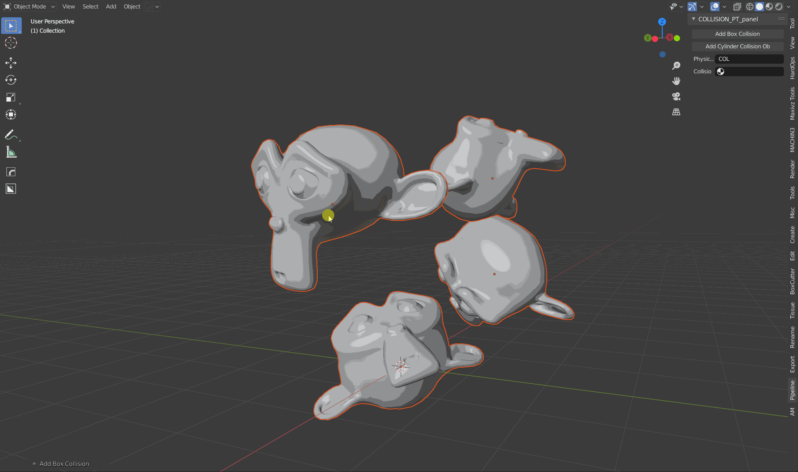

This addon is still in early development. I have been focusing on implementing the base functionality. Some of the features might not work as expected!

# Creating Bounding Geometry
Create simple bounding geometry to use for retopology or collision meshes. I am currently working on the addon architecture and user experience. Therefore, a lot of features are still missing or only implemented for the bounding box. 

# Add bounding box in Object mode
Select multiple objects and add a bounding primitive. 

# Add bounding box in Edit mode 
Select a part of an object and add a bounding primitive either in local or global space. 

